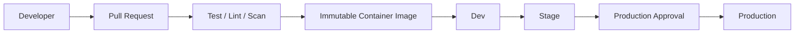

# Delivery Architecture

## Key controls

The same immutable image is promoted across environments. Production should be protected by required reviewers, deployment concurrency, environment-scoped credentials, and post-deployment health checks.

GitHub Actions is the primary implementation, while Azure DevOps and Jenkins examples demonstrate portability across common enterprise CI/CD systems.
